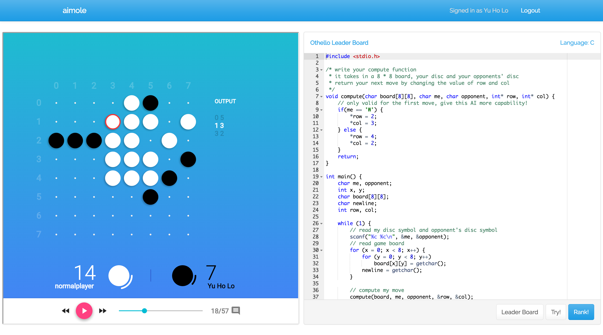

# aimole
> Let AI play against AI

*aimole* is a platform for game playing AI to play against other game playing AI. It is initially developed to support the online course taught by [Dr. Wong Tsz Yeung](http://www.cse.cuhk.edu.hk/~tywong/html/index.html) at [CUHK](http://www.cuhk.edu.hk), see the course [here](http://tywong.github.io/gitbook-engg1110/).

Besides this AI competing platform, there is also an online judge for programming assignments. See [codeSubmit](https://github.com/leoyuholo/codesubmit).

## Games
aimole is modularized to two parts, platform and games. Currently have two games developed and available.

### [Othello](https://github.com/ymcatar/aimole-othello)

### [2048](https://github.com/jjanicechen/aimole-2048)

## Deployment
You are recommended to deploy on ubuntu because the prepared scripts are written for environment of ubuntu machines.

On the ubuntu machine, run `shellscripts/npm/setup_dev.sh` to install all the required packages. These includes docker and node.js. And then run `npm install` to npm dependencies.

aimole persists data on MongoDB and queues jobs on RabbitMQ. To spin them up, you can run `shellscripts/docker/mongodb/mongodb_up.sh` and `shellscripts/docker/rabbitmq/rabbitmq.sh`.

And then, configure aimole by modifying `configs/productionConfig.coffee`.

After configuring, build the static html files by running `grunt html`.

To spin up aimole web server, run `shellscripts/docker/production/web_up.sh`.

To spin up aimole worker, run `shellscripts/docker/production/worker_up.sh`.

For deploying more instances on multiple machines, run the corresponding [web, worker] script with an extra argument of master ip. E.g. `shellscripts/docker/production/worker_up.sh 192.168.0.101` to spin up a worker with databases connecting to `192.168.0.101`. Same for web server.

To install games, run `npm run installGame` with corresponding arguments to retrieve the game repository on github.

## Development
(This is for aimole platform, for aimole games, see Game Development section.)
To spin up all the stuffs for development, run `shellscripts/docker/aimole/aimole.sh`. This will spin up a MongoDB, RabbitMQ, an aimole web server and an aimole worker. It will also watch for file changes to restart all both web and worker instances.

## Game Development
See Othello and 2048 above for references.

There are 3 main components for an aimole game: view, verdict, default ai. And a configuration file `aimole.json`.

View is the beautiful, animated view of the game board, which will be included by the aimole platform through embedding an iframe. You may find [this](http://cdn.rawgit.com/leoyuholo/aimole-example/master/view/iframe.html) tool useful for your development, it can also be found on the [aimole-example](https://github.com/leoyuholo/aimole-example) repository.

Verdict is a piece of code that keeps checking on wether players are making valid moves during the game. It communicates with the players by sending messages to players' stdin and receiving messages from players' stdout. However, these messages are not passing to verdict directly, aimole platform wraps the players' stdin and stdout with extra information, such as player id, time used or even error messages. These wrapped message is passing by stringified JSON through verdict's stdin, and expecting verdict to pass back a stringified JSON through verdict's stdout. You can see the structure of the JSON [here](https://github.com/leoyuholo/aimole/blob/master/server/models/Match.coffee). Command is the JSON structure passing to verdict by aimole platform. Action is the JSON structure passing to aimole platform by verdict.

## Sandbox-run
All the user submitted code are running inside sandbox environment. For each code execution, codeSubmit will spawn docker instances to run the compilation and execution process. This isolates each submission as well as providing security to the host.

This sandbox is a sub-project of Dr. Wong Tsz Yeung's students' final year project. You can find its docker hub repository [here](https://hub.docker.com/r/tomlau10/sandbox-run/).

# LICENSE
This program is free software: you can redistribute it and/or modify
it under the terms of the GNU General Public License as published by
the Free Software Foundation, either version 3 of the License, or
(at your option) any later version.

This program is distributed in the hope that it will be useful,
but WITHOUT ANY WARRANTY; without even the implied warranty of
MERCHANTABILITY or FITNESS FOR A PARTICULAR PURPOSE.  See the
GNU General Public License for more details.

You should have received a copy of the GNU General Public License
along with this program.  If not, see <http://www.gnu.org/licenses/>.
